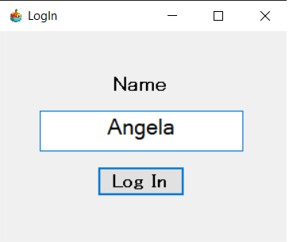
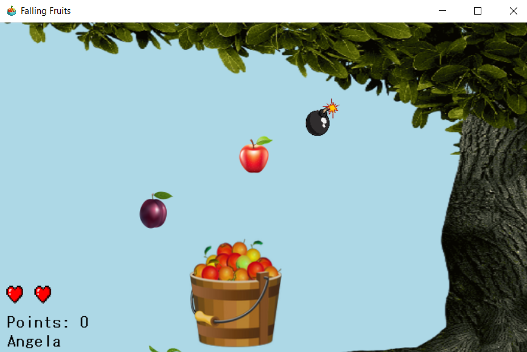
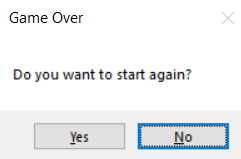
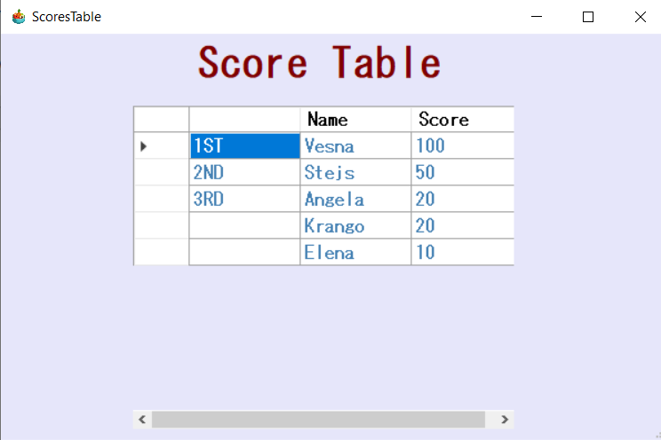

# Falling fruits
# Упатство за стартување на играта

  Бидејќи е имплементирана локална база за да се претстави High Score табелата, 
којашто служи за прикажување на успехот на секој играч којшто ќе ја испроба играта на локалната машина, потребно е 
да се симне целосниот проект и да се стартува со помош на Visual Studio.

# Објаснување на проблемот (апликацијата – кои се функционалностите, за што служи, играта)

  Апликацијата којашто ја развивме со име „Falling Fruits” е кратка игра којашто се базира на идеи исцрпени од повеќе веќепостоечки игри.
Првичната наша идеја беше да се симулира паѓања на овошја од илустрирано дрво, а истите да се собираат во корпа.
Како што ја развивавме идејата, така наидувавме на повеќе иновации и додававме некои нови функционалности.
Играта се игра од само еден играч во дадено време. На почетокот се појавува прозорец чиешто поле е задолжително (валидација), односно внесување на име на корисникот со кое ќе биде запамтен неговиот резултат во табела која се прикажува на крајот од играта. 
Откако корисникот ќе стисне на копчето LogIn истиот започнува со играње на играта. Како и што споменавме, играта започнува со паѓање на овошја. 
Корисникот со помош на корпата која се придвижува во насока лево и десно со притискање на копчињата од тастатура (стрелка во лево и десно) има за задача да собере што е можно повеќе овошја, а со секое собрано овошје резултатот се зголемува за 10 поени.
Овошјата паѓаат со одредена брзина. Покрај овошјата паѓаат и бомби кои играчот треба да ги одбегне. Доколку бомбата биде собрана од играчот, тој губи 20 поени, а со тоа му се одзема и еден живот (на почеток има три животи).
 Животите се симболизирани со срциња, заедно со поените се прикажани во левиот долен агол. 
Доколку при играњето наидува бомба, се појавува мелодиско предупредување на играчот, а доколку играчот ја собере бомбата, тогаш се појавува звук кој укажува дека играчот собрал бомба.
Откако играчот ќе ги изгуби животите, се појавува прозорец кој го прашува дали сака да игра повторно, со можност за одговор Yes/No.
Доколку играчот избрал Yes, тогаш соодветно ја игра играта од почеток, а доколку избрал No, тогаш се појавува табелата која ги содржи резултатите на сите играчи кои ја играле играта претходно, сортирани според нивните поени, а се вметнуваат и поените на играчот кој последно ја играл играта. 
Доколку се случи еден играч по втор пат да ја игра играта во различен временски опсег, а поените кои ги направил во вториот пат се поголеми од претходниот, тогаш табелата се ажурира со ново добиените поени, во спротивно останува иста.

# Да се опише решението на проблемот (кои податоци се чуваат, во какви структури, класи)

  За да се совлада и реализира оваа идеја искористивме две класи, едната за да се имплементира сцената и да се исцрта се на неа, а другата е класата од самата форма. 
Користиме листа PictureBox во која се чуваат сликите од овошјата, а со нејзино изминување направивме неколку функционалности, како движења, брзина, допирања со корпата и слично. 
Исто така со помош на Entity Framework имплементиравме локална база на податоци којашто ги чува корисниците на играта, коишто се најавуваат на почетокот со појавување на првата форма. 
Освен нивниот username, во базата се чува и нивниот high score, којшто се ажурира со секој нов постигнат успех.

# Да се опише барем една ваша функција или класа од изворниот код  на проектот

  Во класата за сцена креираме една функција која проверува дали имаме судир помеѓу овошјата и корпата.
За таа цел, потребно е да ја изминеме листата на овошја во обратен редослед и да провериме дали границите на сликите од овошјата се во судир со границите на корпата.
Доколку овој услов е исполнет, тогаш поените се зголемуваат за 10, а овошјето кое било во судир со корпата се брише од листата на овошја, а истото овошје го снемува на екранот.
Сличен концепт на функција имаме и во делот на паѓање на бомбата, каде што исто ги проверуваме границите на бомбата и корпата, се проверува дали случајно движењето на бомбата ја преминува границата на формата, ако тоа се случува тогаш се генерира нова бомба со нова локација.

public void IsCollected(PictureBox basket)
        {
            for (int i = fruits.Count - 1; i >= 0; i--)
            {
 	   if (fruits[i].Bounds.IntersectsWith(basket.Bounds))
                {
                    Points += 10;
                    RemoveGenerateFruit(fruits[i]);
                }
            }
        }
        
private void timer2_Tick(object sender, EventArgs e)
        {
            bomb.Top += 25;
            if (bomb.Top > this.Height)
            {
                bomb.Location = new Point(Random.Next(100, 500), -60);
            }
            if (bomb.Bounds.IntersectsWith(basket.Bounds))
            {
                scene.Points -= 20;
                if (scene.RemoveHearts())
                {
                    GameOver();
                }
                bomb.Location = new Point(Random.Next(100, 500), -60);
                UpdatePoints();
            }
        }
# Во прилог се дадени слики на делови од апликацијата:

